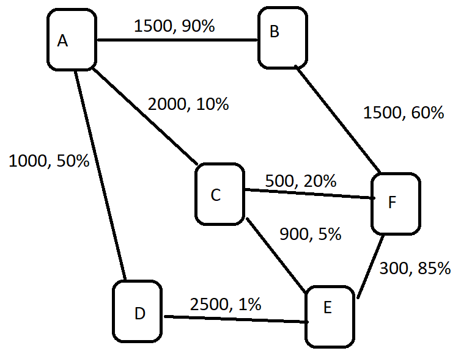

# Практическое задание 1, дедлайн 18.09

К данному заданию приложена схема сети маршрутизаторов/серверов, обменивающихся сетевым трафиком.

Если между двумя узлами сети есть связь, они соединены ребром. Для каждого ребра указана номинальная пропускная способность среды и процент потерянных пакетов во время передачи.

Необходимо выразить данную схему в двух формах: с использованием массива и с использованием узлов.

Код обоих вариантов решения задачи необходимо прикрепить к ответу.



---

---

## **Разница между Link[] и TreeNode[] на практике:**

### Структурные различия

**Link[] (текущая реализация):**

- Плоский список связей между серверами
- Каждая связь содержит два сервера и параметры
- Нет явной информации о топологии дерева/графа

**TreeNode[] (альтернативная реализация):**

- Иерархическая структура с узлами и соседями
- Каждый узел знает о своих соединениях
- Явно выраженная топология сети

### Что изменится при переходе на TreeNode[]:

#### 1. **Преобразование данных**

Нужно будет конвертировать TreeNode[] в формат для d3-force:

```typescript
function convertTreeToGraphData(nodes: TreeNode[]): GraphData {
  const uniqueNodes = new Map<string, Node>();
  const links: Link[] = [];

  nodes.forEach(treeNode => {
    // Добавляем текущий узел
    if (!uniqueNodes.has(treeNode.server.name)) {
      uniqueNodes.set(treeNode.server.name, {
        ...treeNode.server,
        id: treeNode.server.name
      });
    }

    // Добавляем связи
    treeNode.neighbors.forEach(neighbor => {
      if (!uniqueNodes.has(neighbor.node.server.name)) {
        uniqueNodes.set(neighbor.node.server.name, {
          ...neighbor.node.server,
          id: neighbor.node.server.name
        });
      }
      links.push(neighbor.link);
    });
  });

  return calculateLayout(links);
}
```

#### 2. **Преимущества TreeNode[]**

- **Легче обнаруживать циклы** в графе
- **Проще находить пути** между узлами
- **Нативная поддержка иерархии** - можно строить деревья
- **Лучшая производительность** для алгоритмов обхода графа

#### 3. **Недостатки TreeNode[]**

- **Дублирование данных** (связи хранятся в двух узлах)
- **Сложнее сериализовать** в JSON из-за циклических ссылок
- **Требует больше памяти**

#### 4. **Практические изменения в компоненте**

**Текущий вариант (Link[]):**

```jsx
<NetworkGraphLinks links = { links } />
```

**Новый вариант (TreeNode[]):**

```jsx
<NetworkGraphTree nodes = { nodes } />
```

#### 5. **Рекомендация**

**Оставьте текущую реализацию с Link[] для визуализации**, так как:

- d3-force оптимизирован для работы со списком связей
- Меньше преобразований данных
- Проще дебажить

**Используйте TreeNode[] для бизнес-логики**, если нужно:

- Находить кратчайшие пути
- Обнаруживать циклы
- Строить деревья маршрутизации

**Гибридный подход** - конвертируйте TreeNode[] в Link[] для визуализации, но используйте TreeNode[] для вычислений.

## Личный вывод

Списки хорошо подходят для рендеринга.

Деревья хорошо подойдут для описания бизнес логики.

Поэтому на практике нужно работать с обоими вариантами.

Ранее так и делал на основании интуиции теперь более осознанно.  

Польза от изучения как по мне в первую очередь в осознанности,
применения своих навыков при решении задач,
во вторых мы можем узнать что-то новое если мы этого ещё не знаем.
